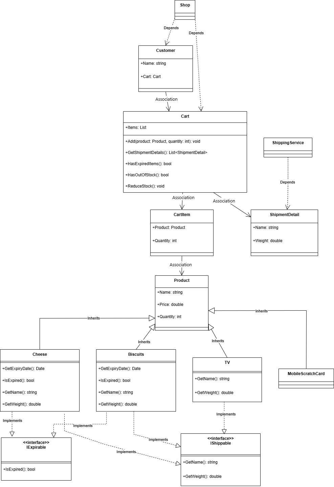

# Fawry Task - Shopping Cart Application

## Class Diagram

---

## Application Overview

This repository contains a shopping cart application implemented in both C# and Java. The application models a simple e-commerce system with the following features:

- **Product Hierarchy:** Abstract `Product` class with concrete subclasses (`Cheese`, `Biscuits`, `TV`, `MobileScratchCard`).
- **Interfaces:** `IShippable` and `IExpirable` interfaces for products that can be shipped or expire.
- **Cart and CartItem:** A `Cart` holds multiple `CartItem` objects, each referencing a `Product` and its quantity.
- **Customer:** Each customer has a cart.
- **ShippingService:** Handles shipment details and prints shipment notices.
- **Shop:** Static class for shop operations.

## Project Structure

- `C#/` - C# implementation
- `Java/` - Java implementation

## Notes
- The class diagram above provides a high-level overview of the main classes and their relationships.
- The code is organized for clarity and extensibility, following object-oriented principles.

---

Feel free to contribute or open issues for suggestions and improvements! 
